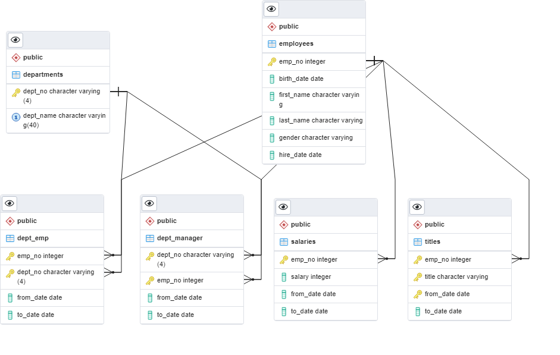

# Pewlett-Hackard-Retirement-Analysis

## Overview: 

With `SQL` and `pgAdmin` I helped Pewlett Hackard's Human Resources create an employee database with the six CSV files provided to us found in the "Data" folder on this repository. This database was used to determine how many employees in the next few years will be retiring and how many positions Pewlett Hackard should be prepared to fill.

#

## Process:

First I needed to create the tables in pgAdmin and import the CSV files accordingly. Below is the code I used to complete the query for the dept_manager table and I continued with the same syntax to query all six tables.

 

   

 

 #     

As I analyzed the data I determined the `Primary Key(s)` and `Foreign Key(s)`(if present) for each table and assigned these keys as I created them. I then created an `ERD` "Entity Relationship Diagram" to better visualize the relationship between each table. The below ERD includes the data type and relational information within the database we have created.

 

 

 #

 

Next, I retrieved the needed information from the "Employees" and "Titles" table and created a new table with the `INTO` clause. The two tables were joined on their primary keys and filtered to retrieve only the employees with a date of birth between 1952 and 1955. The results were then exported into the "retirement_titles.csv" located in the `Data` folder. Below is a screenshot of the first ten rows of the table created when the query was ran before exporting into the designated CSV file.

 

 

#

 

Using the `DISTINCT ON` statement I retrieved the first occurence of the employee number for each set of rows defined by the ON ( ) clause. Sorting by the emp_no and in ascending order by the last date of their most recent title, I exported the table into the "unique_titles.csv" file. I then wrote another query found in the Employee_Database_Challange.sql file to retrieve the number of employees who are about to retire by their most recent job title in the "unique-titles.csv" file. Lastly, I exported the results to a new CSV file named "retiring_titles.csv" found in the "Data" folder. Below is the code I used in pgAdmin.

 

 
 

Below are the tables created from the above queries:

 

#### unique_titles:

 

#### Retiring_Titles_Results:

 
 

#

 
 

My final task was to create a `mentorship-eligibility` table that holds the current employees who were born between January 1, 1965 and December 31, 1965. Provided below is the code that I used to create the table and export to a CSV named "mentorship_eligibility.csv". Only 1,549 employees qualify for the mentorship program.

 

 

 

#

## Conclusion:

 

- Referencing the retirement_titles_results above, Pewlett Hackard can now expect that they have 90,398 employees who may retire when matched to the critera they gave for retirement eligible employees. 

- Out of those employees leaving, there are 29,414 Senior Engineers, 28,254 Senior Staff, 14,222 Engineers, 12,243 Staff, 4,502 Technique Leaders, 1,761 Assistant Engineers, and 2 Managers.

- PH has around 90,398 positions to fill if all eligible employees retire.

- With only 1,549 employees eligible for the mentorship program, it is crucial for the future success of PH that they start training the replacements for when the majority of retirement eligible employees leave.

#

## Resources:

 

- Provided Dataset:
    - deparments.csv
    - dept_emp.csv
    - dept_manager.csv
    - employees.csv
    - salaries.csv
    - titles.csv

 

- Software:
    - SQL
    - PostgreSQL
    - pgAdmin

     
 
    

